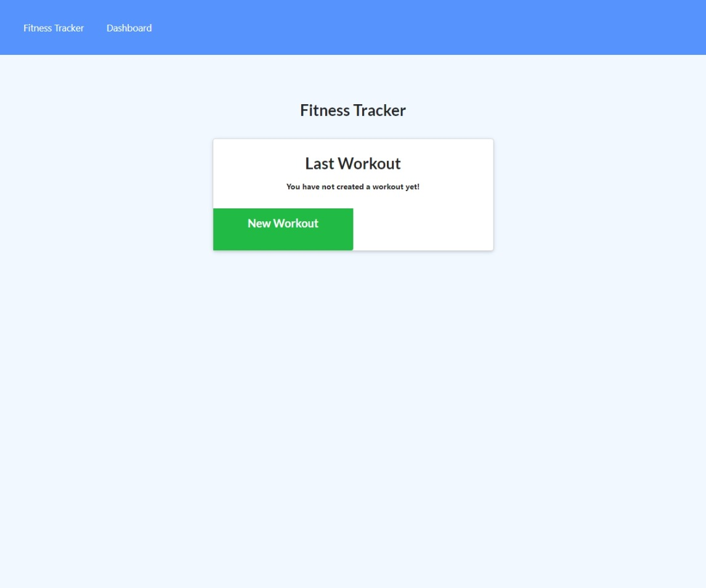

# Workout_tracker


## About Project
This web application helps you monitor your workouts. When you first open the application, you're presented with a new workout button and if you already have a workout added there will also be a complete workout button. When you press one of the buttons you will be presented with a form that has exercise type, exercise name, weight, sets, reps, and durations. You can complete the workout or add the exercise with the two buttons at the bottom. Once you enter your new workout you can go back to the fitness tracker tab and look at your latest workouts or go to the dashboard tab to view your workouts overtime. On the dashboard he will view 2 graphs one for the duration and one for the weight.
## Built With
This web application was built using the following programming language, and tools. Programmed with javasricpt and used Express.js API for routing. For the database I used mongodb and mongoose. And its deployed by using Heroku.
## Installation

  Clone the repo
   ```sh
   git clone git@github.com:missile11011/Workout_tracker.git
   ```
## Contact
Misael Reyes - misaelrey@gmail.com

Project Link: [https://dry-harbor-79395.herokuapp.com/](https://dry-harbor-79395.herokuapp.com/)
